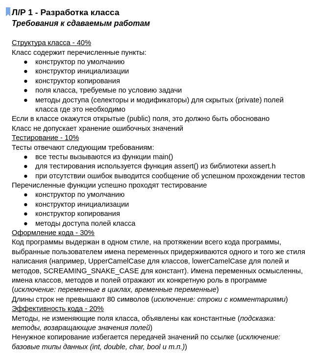
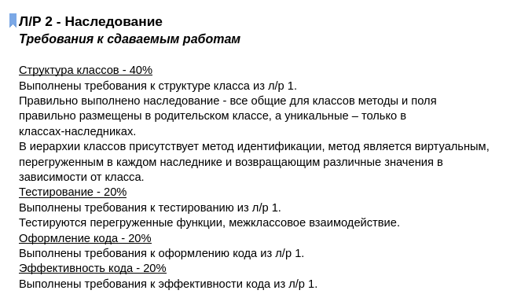
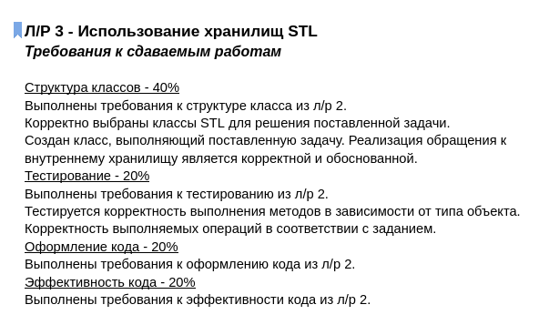
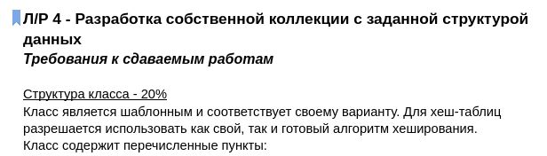
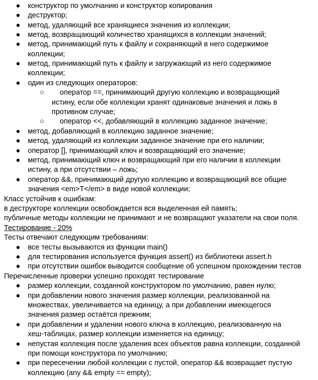
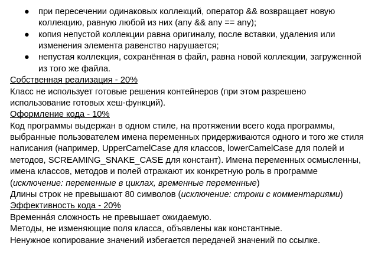

## Задание

Сотрудники института биоинформатики хотят восстановить первичную структуру белка, для чего требуется объединить его (частично пересекающиеся) фрагменты. Требуется написать программу, которая хранит белковые последовательности (в виде списков аминокислот) и умеет их объединять, если аминокислоты в конце одной последовательности совпадут с аминокислотами в начале другой.

Реализовать:

1. Класс трансляции протеиногенной аминокислоты, умеющий синтезировать ее по хранимому коду из последовательно поступающих нуклеотидов, закодированных при помощи однобуквенных обозначений. 

2. Класс белковой последовательности, умеющий синтезировать последовательность из нуклеотидов и других аминокислот. 

3. Белок (последовательность аминокислот); операция сложения, возвращающая результат сложения (с пересечением) двух белков

